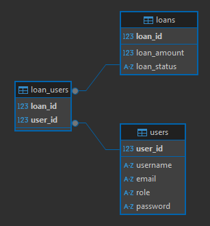

# FNMALoanAppMock

- Basic CRUD app, good reference for what they need to show for phase 1. Javalin for HTTP request handling (and session stuff). Good ol JDBC for DB ops. 
- Basic validation in services, good-enough-for-a-demo error handling. Some stubs for associates to take on.
- Pending SQLite refactor branch in case we do need it
- No tests or logs yet... will I add some?? IDK
- Will split phases into branches later

### Phase 1 ERD

